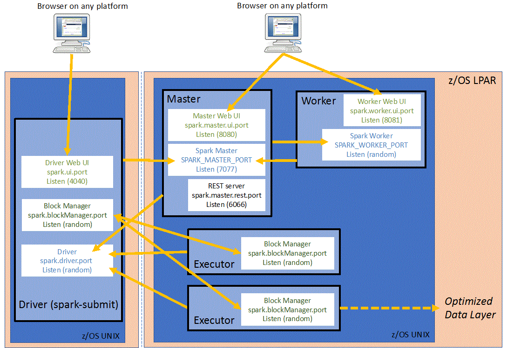

This Helm chart deploy a standalone Spark cluster on kubernetes.

There are 2 components:
- master as a Deployment
- worker as a StatefulSet

Then Spark applications are submitted:

```
spark-submit --master spark://spark-cluster-svc:7077
```

## Why this chart, and dont use kubernetes master?

Spark may use natively Kubernetes to create a cluster, in this scenario,
there is no master pod, and there are workers pods.

The bad thing is: this is not a cluster!

You submit job, k8s create workers pods, job end, pods died.

Not good in case you run many small jobs, this is why we have created this chart.

## Network

This is a very important part of a cluster: networking.

According this schema from https://www.ibm.com/docs/en/zpfas/1.1.0?topic=spark-configuring-networking-apache:



**Rule is quite simple, all pieces must communicate with each others!**

## Usage

```
helm install . my-cluster
```